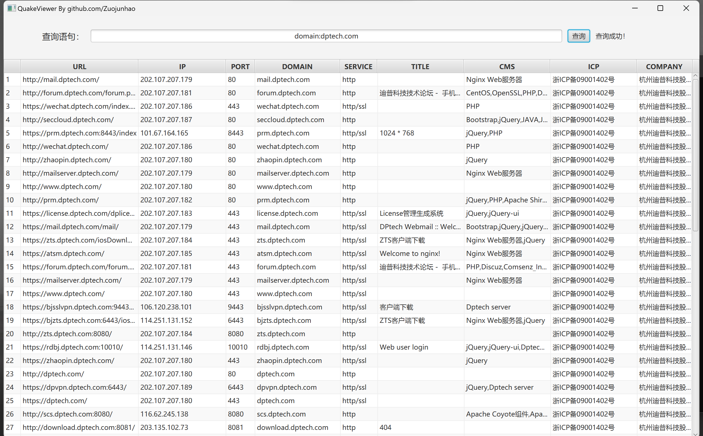
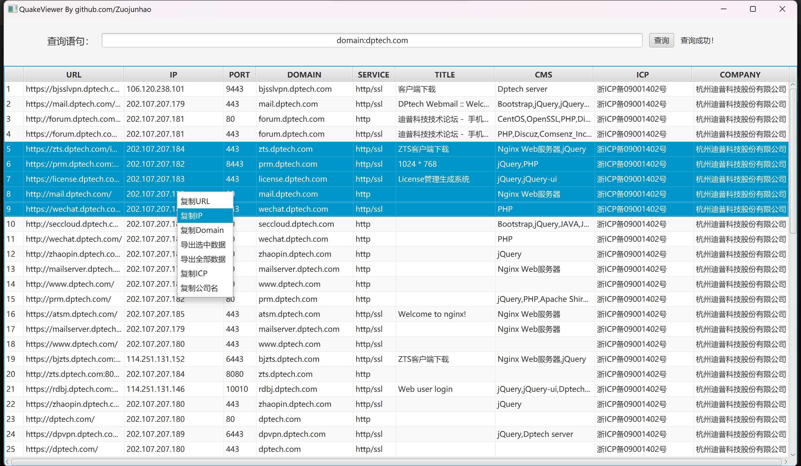
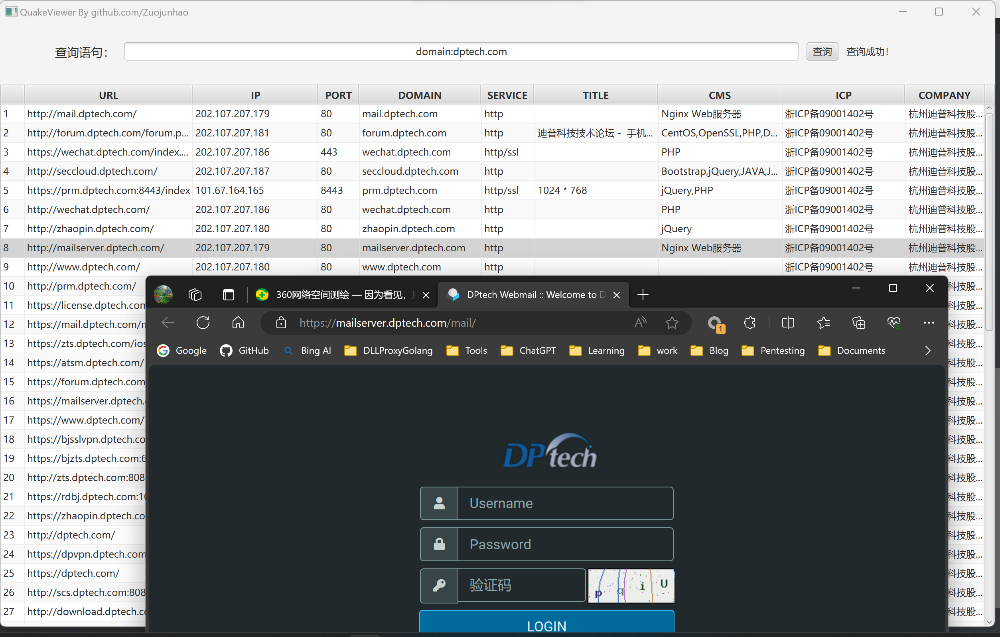
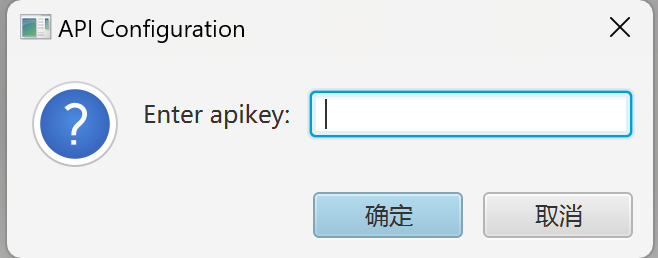
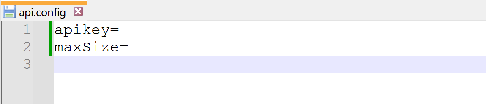

# QuakeViewer 360 Quake API 图形化客户端

## 使用方法

Release中的jar包请在jdk8环境运行：

```
java -jar QuakeViewer.jar
```

查询效果如图所示：



可以右键复制URL、ip等内容，可以导出选中的数据、全部查询数据：



双击可以实现跳转：



## 配置API-KEY

第一次运行会弹出提示配置apikey等信息：



配置完成后，会在同文件夹下生成配置文件api.config：



每次重新配置后，请重启应用加载配置。